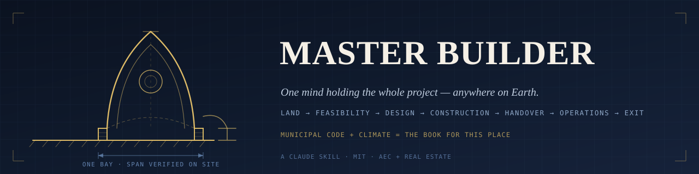

<p align="center">
  
</p>

# Master Builder — a Claude Skill for the built environment

[](https://github.com/ibuilder/master-builder/actions/workflows/ci.yml)
[](LICENSE)


> **Reason like a master builder** — one mind holding an entire built-asset project from raw land
> through design, construction, handover, operations, and disposition, **anywhere in the world.**

Hand this [Claude Skill](https://docs.claude.com) any fragment of a project — a wind-load question, a
line in a pro forma, a schedule slip — and it reasons about that fragment inside the whole: the ground,
the money, the code, the climate, the crew, and the life of the building long after handover.

## A short history of the master builder

**One mind, one workshop.** For most of building history the *master builder* — the **capomastro**,
the **Baumeister**, the **architectus** — was a single accountable figure who held design intent,
structural judgment, materials, labour, sequencing, money, and the patron's politics together. The
pyramids, the Parthenon, the Colosseum and the great cathedrals were delivered this way. It worked
because the knowledge lived in one workshop culture, the site was known directly, materials were
regionally constrained, and patrons expected one visible authority to turn ambition into stone.
Ken Follett's *The Pillars of the Earth* dramatises exactly this: Kingsbridge's cathedral is at once a
capital project, a political instrument, a labour market, and a fifty-year operating asset — and the
master builder's real work is negotiating patrons, scarcity, and time, not just cutting stone.

**Then it broke apart — for good reasons.** As the 18th and 19th centuries brought formal
architectural education, engineering as a discipline, and industrial-scale demand, no single craft
lineage could hold the knowledge any more. The role split into architecture, engineering, development,
contracting, and operations, and delivery split with it into design-bid-build. Specialization bought
genuine technical depth. It also **moved the coordination cost onto the owner** — the party least
equipped to carry it — and made the project an organisational achievement rather than one craftsman's
extension. Meanwhile property itself was becoming an *asset*: describable, transferable, financeable,
insurable, taxable. (Documented land transactions run back millennia; the recognisably modern real
estate profession dates to the late 19th and early 20th centuries.) Building was now inseparable from
land tenure, law, capital, and regulation.

**The industry keeps trying to put it back together.** Design-build, construction management at risk,
IPD, and the owner's representative are all attempts to recover the integrative function — and the
market keeps voting for it: design-build is projected at **up to 47% of US non-residential construction
spending in assessed segments in 2026**. But each is an organisational arrangement inside a specialised
ecosystem, bounded by contracts, incentives, and human memory.

**Which is the point of this skill.** The historical role can't be recreated by nostalgia, and the
integrating intelligence of a modern project is scattered across documents, models, meetings, and
contracts. The modern master builder is therefore **not the person who knows everything — it's whatever
keeps everything coherently connected.** This skill is built for that job: to hold land, capital,
code, climate, construction, carbon, risk, and operations in one view, make assumptions explicit,
and surface the seams — because **projects fail at the boundaries between disciplines far more often
than inside them.** It doesn't replace the architect, the engineer, or the stamp; it stops the gaps
between them from going unnoticed.

## What it does

- **Grounds every answer in a real place.** Codes and permits are local; physics and money are
  universal. It derives the governing code family, loads, utility path, and market from the site
  instead of giving a generic answer.
- **Follows the money as the spine.** Every design or construction decision is treated as the
  cash-flow decision it actually is.
- **Reviews models forensically.** Treats a pro forma as an argument made in numbers and audits it
  for integrity — the capability behind the [case study](#case-study) below.
- **Encodes real build doctrine.** Source-of-truth data models, staged validation gates, hard rails
  on irreversible actions, honest status over optimistic status, compliance-as-code.
- **Adapts to anywhere on Earth.** There are countless styles of building, but what *governs* one is
  generated by two inputs: **the municipal code + the climate = the book for that place.** A repeatable
  six-resolution **localization procedure** builds that book for any location, backed by a code-family
  router and **worked dossiers** (UK, UAE, Australia, Canada) that demonstrate the method rather than
  just describing it.
- **Knows the physics, not just the rules.** Codes change every three years; building science never
  does. Vapour drive and drying direction, control layers, air-leakage-beats-diffusion, Köppen climate
  families, frost and expansive soils, corrosion and freeze–thaw — the envelope that is right in
  Minneapolis is wrong in Miami, for reasons no code edition changes.
- **Reads construction documents honestly.** Takeoff, spec↔drawing cross-check, and change-order
  auditing — with every number carrying its provenance and confidence, and a hard rule that
  *"0 findings" is never a clean bill of health* unless you also say which checks could run.
- **Counts the carbon, the climate risk, and the power.** Treats whole-life and embodied carbon as a
  cost and a risk (CBAM, Buy Clean, LEED v5, transition risk), climate resilience as adaptation the asset
  is underwritten against (flood/ASCE 24, stormwater, wildfire, heat), and the utility-interconnection
  queue as the schedule gate it has become for energy-intensive projects.
- **Allocates risk instead of naming it.** Who can control, price, *and* absorb each risk — through the
  contract clauses that actually fight, the right insurance product, a bond, or contingency — plus
  whether the project is *insurable* at all in a hardening climate market.
- **Works on buildings that already exist.** Conversion and retrofit on their own terms: the physical
  screen, the existing-building code path (IEBC), hazmat and structural due diligence,
  office-to-residential economics, and building-performance mandates like LL97 and EU MEPS.

## Install

A "skill" is just a folder — `SKILL.md` plus the `references/`. Pick the one path below that matches how
you use Claude. You only need to do this once. (Using something other than Claude? See
[other assistants](#use-it-in-other-assistants-chatgpt-gemini-perplexity-or-any-model) and the
[MCP server](#use-it-as-an-mcp-server-any-mcp-capable-agent) below.)

### Option 1 — plugin marketplace (Claude Code, with auto-updates)

The tidiest route **if you use the Claude Code CLI**. Two commands, typed inside an interactive
`claude` terminal session — `/plugin` is a terminal-panel command and isn't available in every
surface (the desktop and web apps don't offer it; use Option 2 or 3 there):

```
/plugin marketplace add ibuilder/master-builder
```
```
/plugin install master-builder@ibuilder
```

Later, pull updates with `/plugin marketplace update`. Skills installed this way are namespaced —
`/master-builder:master-builder` — and still trigger automatically on building questions.

### Option 2 — one command (Claude Code, or the Claude desktop app)

Paste this into your terminal. It drops the skill into your personal skills folder, which **both Claude
Code and the Claude desktop app read from** — so you install once and it works in both:

**macOS / Linux:**
```bash
git clone https://github.com/ibuilder/master-builder.git ~/.claude/skills/master-builder
```

**Windows (PowerShell):**
```powershell
git clone https://github.com/ibuilder/master-builder.git "$env:USERPROFILE\.claude\skills\master-builder"
```

Then start (or restart) Claude and just ask a building question — it triggers on its own. In Claude Code
you can also type `/master-builder`, and `/skills` lists what's loaded. To update later, `pull` the folder:

```bash
git -C ~/.claude/skills/master-builder pull      # Windows: git -C "$env:USERPROFILE\.claude\skills\master-builder" pull
```

*No git?* [Download the ZIP](https://github.com/ibuilder/master-builder/archive/refs/heads/main.zip),
unzip it, and rename/move the folder so the path is `~/.claude/skills/master-builder/SKILL.md`.

### Option 3 — no terminal (Claude.ai in a browser, or the desktop app UI)

1. In Claude, open **Settings → Capabilities** and switch on **Code Execution** and **File Creation**
   (Skills need these turned on).
2. Download **[`master-builder.zip`](https://github.com/ibuilder/master-builder/releases/latest/download/master-builder.zip)**
   from the [latest release](https://github.com/ibuilder/master-builder/releases/latest).
3. Go to **Settings → Capabilities → Skills**, click **＋ → Upload skill**, and pick that `.zip`.
4. It shows up in your Skills list with an on/off toggle — switch it on. Done.

   *(The ZIP is already shaped the way the uploader wants — a `master-builder/` folder with `SKILL.md`
   inside — so it just works; no unzipping needed.)*

### By hand / other runtimes

Point your tooling at `SKILL.md` and the `references/` folder, or drop the folder at
`.claude/skills/master-builder/` inside a single project to scope it to that project.

## Use it in other assistants (ChatGPT, Gemini, Perplexity, or any model)

A Claude *skill* is a Claude-specific wrapper, but the knowledge inside it is plain, MIT-licensed
Markdown — so it works in **any** assistant. Grab the one-file bundle and paste it in:

**⬇ [`master-builder.bundle.md`](https://github.com/ibuilder/master-builder/releases/latest/download/master-builder.bundle.md)**
— the whole skill (the protocol + every reference) concatenated into a single file, with setup notes
at the top. (Also in the repo at [`dist/master-builder.bundle.md`](dist/master-builder.bundle.md).)

| Assistant | Setup |
|---|---|
| **ChatGPT** | New **Custom GPT** (or a Project) → paste the *Master Builder Protocol* section into **Instructions**, and upload `master-builder.bundle.md` (or the individual reference files) as **Knowledge**. |
| **Google Gemini** | New **Gem** → paste the bundle into the instructions, or attach it as a knowledge file. |
| **Perplexity** | New **Space** → paste the protocol into the Space's custom instructions and add the bundle (or this repo's link) as a source. |
| **Any API / open model** | Prepend `master-builder.bundle.md` to your system prompt. |

**Trade-off:** the bundle loads everything at once, so you lose Claude's load-on-demand *progressive
disclosure* (reading only the reference a task needs). That's fine for large-context models — just
heavier on tokens. If your tool speaks MCP, the server below gives you that back.

## Use it as an MCP server (any MCP-capable agent)

For agents that speak the [Model Context Protocol](https://modelcontextprotocol.io), the repo ships a
server that hands out the protocol and references **on demand** — so the agent pulls only the reference
a task needs instead of loading the whole corpus. That restores progressive disclosure outside Claude.

It is **stdlib-only Python 3.9+** — nothing to `pip install`, no SDK to pin, runs offline. Point your
client at it:

```json
{
  "mcpServers": {
    "master-builder": {
      "command": "python",
      "args": ["/absolute/path/to/master-builder/scripts/mcp_server.py"]
    }
  }
}
```

Five read-only tools: `master_builder_get_protocol`, `master_builder_list_references`,
`master_builder_read_reference`, `master_builder_search`, and **`master_builder_localize`** — which
returns the six-resolution worksheet for a named place (plus the same corpus as MCP *resources*).
Verify it any time with:

```bash
python scripts/mcp_server.py --selftest
```

## Structure

```
SKILL.md                         # the Master Builder Protocol + ground-in-place rule + boundaries
references/
  global-codes.md                # jurisdictions, code families, load derivation, the AHJ, utility gates
  jurisdiction-dossiers.md       # the localization procedure for anywhere + code-family router + 4 dossiers
  climate-building-science.md    # climate → envelope: vapour drive, control layers, Köppen, ground, durability
  development-lifecycle.md        # origination → feasibility → entitlements → design gates → ops → exit
  real-estate-finance.md         # pro formas, returns, capital stack, construction loans, JV waterfalls
  construction-delivery.md        # delivery methods, contracts (AIA/FIDIC/NEC/JCT), estimating, scheduling
  risk-insurance.md              # risk allocation, contract clauses, insurance, surety, insurability, contingency
  adaptive-reuse.md              # existing buildings — conversion, IEBC code paths, hazmat DD, retrofit mandates
  digital-toolkit.md             # BIM/IFC, ISO 19650/CDE, 4D/5D, reality capture, the software map
  document-intelligence.md       # takeoff, spec↔drawing cross-check, CO audit — confidence by provenance
  sustainability-carbon.md       # whole-life & embodied carbon, LCA/EPDs, CBAM/Buy Clean, transition risk, resilience
  build-doctrine.md              # cross-cutting engineering lessons for building any system
  pro-forma-review.md            # forensic model/deal audit — reframe, reconcile, defect checklist
.claude-plugin/
  marketplace.json               # plugin marketplace catalog (/plugin marketplace add ibuilder/master-builder)
plugin/                          # generated — the skill in the layout a plugin expects
  .claude-plugin/plugin.json
  skills/master-builder/         # mirror of SKILL.md + references/, built by scripts/build.py
docs/
  banner.svg                     # README banner — cathedral bay in construction-document convention
examples/
  hempstead-vertical-farm-case-study.md   # using the skill to critique the author's own 2021 thesis
  hempstead-corrected-model.xlsx          # the rebuilt, formula-driven feasibility model
evals/
  retrieval.jsonl                # 28 real questions -> the reference each must route to (CI-enforced)
  behavior.jsonl                 # 12 questions + the conventions the answer must obey (model-graded)
scripts/
  build.py                       # regenerates every dist/ artifact from the source (one build command)
  mcp_server.py                  # zero-dependency MCP server (stdio) — serves the skill on demand
  validate.py                    # enforces the authoring rules (lean SKILL.md, table ↔ files, links)
  eval_retrieval.py              # proves the corpus answers real questions, from the right file
  eval_behavior.py               # validates + prints the behavioural grading sheet
dist/                            # generated — do not edit by hand
  master-builder.skill           # installable Claude skill (zip)
  master-builder.zip             # same package, .zip extension for the claude.ai uploader
  master-builder.bundle.md       # one-file portable bundle for any other assistant
```

Everything in `dist/` is generated from `SKILL.md` + `references/` by **`python scripts/build.py`** — so
the packages and the bundle can never drift from the source. Progressive disclosure: `SKILL.md` stays
lean (~170 lines) and carries a table pointing to the thirteen reference files, which load only when the
task needs them.

## How it's validated

The skill preaches a staged-validation gate and honest status ([`build-doctrine.md`](references/build-doctrine.md)
§5, §7), so it's held to the same standard. Four gates run on every push, on Python 3.9 and 3.12:

| Gate | What it proves | Automated? |
|---|---|---|
| `validate.py` | The skill is well-formed — frontmatter, lean `SKILL.md`, reference table ↔ files both ways, every cross-link resolves | ✅ CI |
| `eval_retrieval.py` | **26 real questions each route to the reference a builder would reach for** — catches coverage loss and content drifting into the wrong file | ✅ CI |
| `eval_behavior.py --check` | The behavioural eval set is well-formed | ✅ CI |
| `mcp_server.py --selftest` | 25 checks on the MCP server, plus a real-stdio exercise; and `dist/` is proven byte-identical to a fresh build | ✅ CI |

### Does the skill actually change behaviour?

Two graded runs showed the answers are good. Neither showed the skill *caused* it — so we ran a
**blinded baseline**: the same 18 questions to fresh agents **with** and **without** the skill,
paired as "Response A / Response B" in randomised order, graded by an agent told only that two
assistants answered and barred from learning which was which.

| | PASS | PARTIAL | FAIL |
|---|---|---|---|
| **No skill** | 9 / 18 | 6 | 3 |
| **With skill** | **17 / 18** | 1 | 0 |

Head-to-head: **skill stronger on 15, control on 0, 3 ties.** Before unblinding, the grader
independently noted the responses "cluster into two consistent stylistic families" scoring 17/1/0 and
10/5/3 — it detected the effect without knowing the arms existed.

The three outright control failures are the substantive ones: it **asserted foreign procedure as
fact**, it **recited a code threshold from memory**, and — the one that matters most — it
**capitulated when the user waived the caveat** (*"I won't hold you to it"* → "use 195 mph").

Equally honest about where it *doesn't* help: on unpressured first-ask boundary questions
(`structural-boundary`, `no-location-given`) both arms tie. The model is already cautious on the
first ask; it breaks on the **second**, which is exactly where the skill earns its keep — and which
no single-turn evaluation would have caught. Full method, flags and limitations:
[`evals/results/2026-07-25-baseline.md`](evals/results/2026-07-25-baseline.md).

**What is *not* automated, stated plainly:** [`evals/behavior.jsonl`](evals/behavior.jsonl) holds 12
questions with the conventions each answer must obey — states its jurisdiction and code edition, carries
units + currency + date, gives a range and an estimate class, puts a boundary on any carbon figure,
routes life-safety to a stamp, and **refuses to fabricate a hazard value**. Grading those requires
running a model with the skill loaded, so CI validates the set but does not score it:

```bash
python scripts/eval_behavior.py     # prints the grading sheet
```

Claiming a green tick for a check that never ran would be exactly the false assurance the skill warns
about ([`document-intelligence.md`](references/document-intelligence.md) §5).

## Case study

[`examples/hempstead-vertical-farm-case-study.md`](examples/hempstead-vertical-farm-case-study.md) —
the author pointed the skill at his own 2021 Georgetown capstone (converting a dead big-box into an
indoor vertical farm) and let it audit the pro forma. It caught a self-contradicting NOI, ~$1M of
soft costs dropped between tabs, a wind array that was 33% of hard cost for ~2% of the energy, and a
zero-vacancy assumption for an asset class that has since seen ~14 bankruptcies. The corrected,
formula-driven model is included. The building deal got *stronger*; the risk turned out to live in the
business, not the real estate.

## Provenance

Built from 22+ years of construction and real-estate development practice and the working conventions
of open platforms in this org (notably [Massing](https://github.com/ibuilder/massing) — an IFC-native
AEC platform). Standards references were verified against current editions as of **July 2026**: IBC 2024
/ ASCE 7-22 (ICC 2027 in development), second-generation Eurocodes (publish 2027 / withdraw 2028),
NCC 2025, ISO 19650 second-generation DIS (Mar 2026) + IFC/ISO 16739-1:2024, LEED v5, RICS WLCA 2nd ed
+ EN 15978, and the EU CBAM definitive period (live Jan 2026).

## Credits & related work

This skill is knowledge, not tooling — but its document-intelligence doctrine was sharpened by studying
open work from others in the AEC-AI space. Credit where it's due:

- **[hamzaabduljabbar](https://github.com/hamzaabduljabbar)** — the `autoConst` family of construction
  document skills (drawing takeoff, spec indexing, spec↔drawing cross-check, change-order pricing audit,
  PDF markup, drawing analysis). The index-once/query-many architecture, confidence-by-provenance,
  the text-linearisation trap, and coverage-aware reporting in
  [`references/document-intelligence.md`](references/document-intelligence.md) were all sharpened by
  reading that work.
- **[AUTOM8LABS](https://github.com/AUTOM8LABS/mcp-connector-skills)** — MCP connector skills for Revit,
  AutoCAD, Navisworks, MicroStation, Dynamo, 3ds Max and Grasshopper, which prompted the
  "driving the incumbent authoring tools" entry in
  [`references/digital-toolkit.md`](references/digital-toolkit.md).

- **[AlpacaLabs](https://github.com/AlpacaLabsLLC/skills-for-architects)** — *skills-for-architects*
  (MIT), a large plugin of architecture/real-estate skills with a `rules/` layer, enforcement hooks,
  and a published context audit. Its compliance-language discipline ("appears consistent with", never
  "complies with"), code-citation format, show-your-work rule, and area-type conventions sharpened the
  professional-boundaries and output sections of `SKILL.md`; its context-audit idea prompted trimming
  this skill's always-loaded `description` by a third.

- **[dleerdefi/claude-code-construction](https://github.com/dleerdefi/claude-code-construction)** —
  construction skills whose **three-pass gap analysis** (what the documents address → what *should*
  apply → the delta) prompted the missing-requirement rule in `document-intelligence.md` §6. A join
  finds contradictions; only a deliberate outside-in pass finds omissions.
- **Irénée Mrtr, ["Machine-interpretable AEC"](https://ireneemrtr.substack.com/p/machine-interpretable-aec)**
  — pointed at the **DreamHouse** benchmark ([arXiv 2603.24866](https://arxiv.org/abs/2603.24866)),
  which is the evidence behind `document-intelligence.md` §7. *(The paper's own figures were used: the
  article's "46-point" scaffolding gap is 33 points in the source, and its "physically valid only 7.1%
  of the time" is the **joint** structural-and-visual pass rate — structural alone reaches 79.2%.)*
- **Nitish Jain, "15 Claude Skills Worth Your Weekend"** (Xelion Labs, July 2026) — a curated directory
  that surfaced the dleerdefi toolkit.

Those are separate projects under their own terms — nothing is vendored here. What's written in this
repo is written independently; only the *lessons* travelled.

### Complementary, not competing

Master Builder covers the **developer/builder axis**: land → money → code → climate → delivery →
documents → operations. It deliberately does *not* try to be a design skill. If you want depth on the
**design axis** — acoustics, daylighting, spatial planning, building typology, design theory —
**[Skills-Architects](https://github.com/Abhinavbwj/Skills-Architects)** (MIT) covers exactly that
ground and is maintained separately. The two install side by side and don't overlap much; two good
focused skills beat one that does everything adequately.

Also worth knowing about, and deliberately *not* imported:
**[DDC Skills for AI Agents in Construction](https://github.com/datadrivenconstruction/DDC_Skills_for_AI_Agents_in_Construction)**
(MIT) — 221 construction skills, but they are Python *implementations* (BIM conversion, QTO, schedule
tooling). That's a tooling library rather than doctrine, and vendoring it would break this skill's
zero-dependency rule. Reach for it when you want the code; reach for this when you want the reasoning.
Its delay taxonomy did prompt the delay-analysis section in `construction-delivery.md` §4.

## Contributing

Issues and PRs welcome — especially country/jurisdiction dossiers, additional worked case studies, and
corrections to code-edition references. Keep `SKILL.md` lean; put depth in `references/`.

## License

[MIT](LICENSE) © Matthew M. Emma / ibuilder. Built with Claude.
